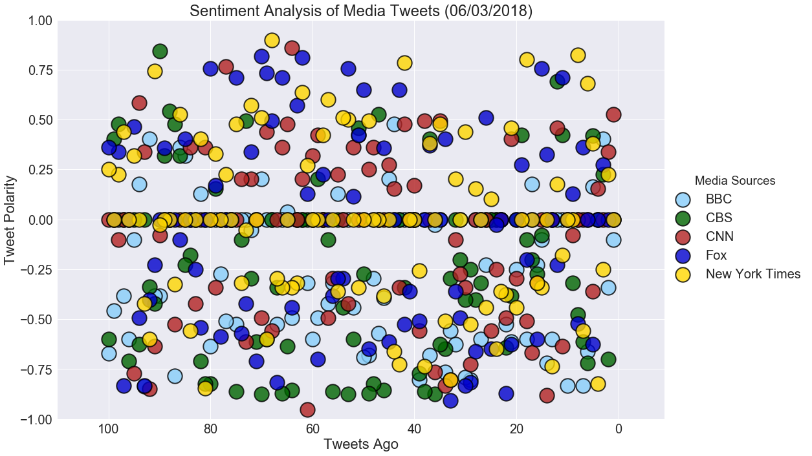
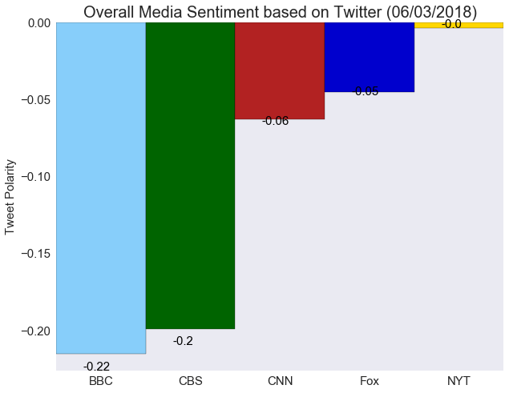

# News Mood

## Analysis
#### Observed trend 1 - At the time of writting the analysis report (6/3), the last 100 twitter messages made by all the news organizations are, to some extent, negative (compound score < 0).
#### Observed trend 2 - Of the five news orgs, New York Times, with the average compound score equals to -0.004, has the most neutral comments on their twitter news channel.
#### Observed trend 3 - Overall, the most tweets made through the five news orgs are neutral by referring to the first plot of the sentitment analysis.


```python
# Dependencies
import tweepy
import numpy as np
import pandas as pd
import seaborn as sns
import matplotlib.pyplot as plt
from datetime import datetime
# Import and Initialize Sentiment Analyzer
from vaderSentiment.vaderSentiment import SentimentIntensityAnalyzer

# Current date
today = datetime.today().strftime("%m/%d/%Y")
analyzer = SentimentIntensityAnalyzer()

# Twitter API Keys
from config import (consumer_key,
                    consumer_secret,
                    access_token,
                    access_token_secret)

# Setup Tweepy API Authentication
auth = tweepy.OAuthHandler(consumer_key, consumer_secret)
auth.set_access_token(access_token, access_token_secret)
api = tweepy.API(auth, parser=tweepy.parsers.JSONParser())
```

## Retrieving the data through Tweepy API


```python
# Target twitter accounts and actual names
news_org_twitter_names = ['@BBCWorld','@CBSNews','@CNN','@FoxNews','@nytimes']
news_org_names = ['BBC','CBS','CNN','Fox','New York Times']
# A dictionary used to convert twitter account to actual name
twitter_name_to_actual_name ={'@BBCWorld':'BBC',
                              '@CBSNews':'CBS',
                              '@CNN':'CNN',
                              '@FoxNews':'Fox',
                              '@nytimes':'New York Times'}

# Colors for the news channels
color_names = ['lightskyblue','darkgreen','firebrick','mediumblue','gold']


colors = dict(zip(news_org_names, color_names))
```


```python
# Create a function for the sentiment analysis of each news org
def get_sentiments(target_user):
    # Variables for holding sentiments
    sentiments = []

    # Counter
    counter = 1

    # Variable for max_id
    oldest_tweet = None
    
    # Loop through 5 pages of tweets (total 100 tweets)
    for x in range(5):

        # Get all tweets from home feed
        public_tweets = api.user_timeline(target_user, max_id = oldest_tweet)

        # Loop through all tweets 
        for tweet in public_tweets:

            # Print Tweets
            # print("Tweet %s: %s" % (counter, tweet["text"]))

            # Run Vader Analysis on each tweet
            results = analyzer.polarity_scores(tweet["text"])
            compound = results["compound"]
            pos = results["pos"]
            neu = results["neu"]
            neg = results["neg"]
            tweets_ago = counter

            # Get Tweet ID, subtract 1, and assign to oldest_tweet
            oldest_tweet = tweet['id'] - 1

            # Add sentiments for each tweet into a list
            media_source = twitter_name_to_actual_name.get(target_user)
            
                
            sentiments.append({"Media Sources":media_source,
                               "Compound": compound,
                               "Positive": pos,
                               "Negative": neg,
                               "Neutral": neu,
                               "Date": tweet["created_at"],
                               "Text": tweet["text"],
                               "Tweets Ago": counter})

            # Add to counter 
            counter += 1
    return sentiments
```


```python
# Pull the data via Tweepy API
sentiments = list()
for target in news_org_twitter_names:
    sentiments += get_sentiments(target)
```


```python
# Convert sentiments to DataFrame 
sentiments_pd = pd.DataFrame.from_dict(sentiments)
# Re-order the columns
sentiments_pd = sentiments_pd[['Media Sources','Negative','Neutral','Positive','Compound',
                               'Tweets Ago','Date','Text']]
```


```python
# Visualize the dataframe
sentiments_pd.head()
```


<div>
<style scoped>
    .dataframe tbody tr th:only-of-type {
        vertical-align: middle;
    }

    .dataframe tbody tr th {
        vertical-align: top;
    }

    .dataframe thead th {
        text-align: right;
    }
</style>
<table border="1" class="dataframe">
  <thead>
    <tr style="text-align: right;">
      <th></th>
      <th>Media Sources</th>
      <th>Negative</th>
      <th>Neutral</th>
      <th>Positive</th>
      <th>Compound</th>
      <th>Tweets Ago</th>
      <th>Date</th>
      <th>Text</th>
    </tr>
  </thead>
  <tbody>
    <tr>
      <th>0</th>
      <td>BBC</td>
      <td>0.287</td>
      <td>0.463</td>
      <td>0.250</td>
      <td>-0.1027</td>
      <td>1</td>
      <td>Sun Jun 03 20:32:04 +0000 2018</td>
      <td>San Diego marathon: 'Active shooter arrested' ...</td>
    </tr>
    <tr>
      <th>1</th>
      <td>BBC</td>
      <td>0.167</td>
      <td>0.833</td>
      <td>0.000</td>
      <td>-0.3400</td>
      <td>2</td>
      <td>Sun Jun 03 19:45:40 +0000 2018</td>
      <td>Dancing FBI agent drops gun during backflip an...</td>
    </tr>
    <tr>
      <th>2</th>
      <td>BBC</td>
      <td>0.000</td>
      <td>0.748</td>
      <td>0.252</td>
      <td>0.4019</td>
      <td>3</td>
      <td>Sun Jun 03 18:11:52 +0000 2018</td>
      <td>Slovenia election: Anti-immigrant SDS party le...</td>
    </tr>
    <tr>
      <th>3</th>
      <td>BBC</td>
      <td>0.000</td>
      <td>1.000</td>
      <td>0.000</td>
      <td>0.0000</td>
      <td>4</td>
      <td>Sun Jun 03 16:45:10 +0000 2018</td>
      <td>Soyuz space capsule brings ISS crew back after...</td>
    </tr>
    <tr>
      <th>4</th>
      <td>BBC</td>
      <td>0.000</td>
      <td>0.858</td>
      <td>0.142</td>
      <td>0.1655</td>
      <td>5</td>
      <td>Sun Jun 03 16:25:39 +0000 2018</td>
      <td>Trump 'could pardon himself over Russia but wo...</td>
    </tr>
  </tbody>
</table>
</div>


```python
# Check the each news org has 100 tweets
groupby_media = sentiments_pd.groupby('Media Sources')
groupby_media.count()
```


<div>
<style scoped>
    .dataframe tbody tr th:only-of-type {
        vertical-align: middle;
    }

    .dataframe tbody tr th {
        vertical-align: top;
    }

    .dataframe thead th {
        text-align: right;
    }
</style>
<table border="1" class="dataframe">
  <thead>
    <tr style="text-align: right;">
      <th></th>
      <th>Negative</th>
      <th>Neutral</th>
      <th>Positive</th>
      <th>Compound</th>
      <th>Tweets Ago</th>
      <th>Date</th>
      <th>Text</th>
    </tr>
    <tr>
      <th>Media Sources</th>
      <th></th>
      <th></th>
      <th></th>
      <th></th>
      <th></th>
      <th></th>
      <th></th>
    </tr>
  </thead>
  <tbody>
    <tr>
      <th>BBC</th>
      <td>100</td>
      <td>100</td>
      <td>100</td>
      <td>100</td>
      <td>100</td>
      <td>100</td>
      <td>100</td>
    </tr>
    <tr>
      <th>CBS</th>
      <td>100</td>
      <td>100</td>
      <td>100</td>
      <td>100</td>
      <td>100</td>
      <td>100</td>
      <td>100</td>
    </tr>
    <tr>
      <th>CNN</th>
      <td>100</td>
      <td>100</td>
      <td>100</td>
      <td>100</td>
      <td>100</td>
      <td>100</td>
      <td>100</td>
    </tr>
    <tr>
      <th>Fox</th>
      <td>100</td>
      <td>100</td>
      <td>100</td>
      <td>100</td>
      <td>100</td>
      <td>100</td>
      <td>100</td>
    </tr>
    <tr>
      <th>New York Times</th>
      <td>100</td>
      <td>100</td>
      <td>100</td>
      <td>100</td>
      <td>100</td>
      <td>100</td>
      <td>100</td>
    </tr>
  </tbody>
</table>
</div>


```python
# Save the dataframe to a CSV file
sentiments_pd.to_csv("news_mood.csv",index=False)
```

## Plotting sentiment analysis of media tweets


```python
# Plot the sentiments
sns.set_style("darkgrid")
sns.set(font_scale = 2)
# plt.figure(figsize=(50,30))
g = sns.lmplot(x='Tweets Ago',
               y='Compound',
               data=sentiments_pd,
               scatter_kws={'edgecolors':'black',
                            'linewidths':2,
                            'alpha': 0.8,
                            's': 500},             
               hue='Media Sources',
               palette=colors,
               fit_reg=False,
               size=10,
               aspect=1.5,
               legend_out=True)

# set xlim and ylim
g.ax.set_xlim(sentiments_pd['Tweets Ago'].max()+10,sentiments_pd['Tweets Ago'].min()-10)
g.ax.set_ylim(-1,1)
# title, labels
g.ax.set_title(f"Sentiment Analysis of Media Tweets ({today})")
g.ax.set_xlabel("Tweets Ago")
g.ax.set_ylabel("Tweet Polarity")
# save the plot
plt.savefig('Plot1- sentiment analysis.png')
plt.show()
```





## Plotting overall media sentiment


```python
overall_sentiments_series = sentiments_pd.groupby('Media Sources')['Compound'].mean()
```


```python
colors = {'BBC': 'lightskyblue',
         'CBS': 'darkgreen',
         'CNN': 'firebrick',
         'Fox': 'mediumblue',
         'NYT': 'gold'}
add_color = lambda org: colors.get(org)
```


```python
overall_sentiments_pd = overall_sentiments_series.to_frame()
overall_sentiments_pd.reset_index(inplace=True)
# Rename New York Times to NYT
indx=overall_sentiments_pd[overall_sentiments_pd['Media Sources']=='New York Times'].index
overall_sentiments_pd.loc[indx,'Media Sources'] = 'NYT'
# Add colors to the dataframe
overall_sentiments_pd['Colors'] = overall_sentiments_pd['Media Sources'].apply(add_color)
```


```python
overall_sentiments_pd
```


<div>
<style scoped>
    .dataframe tbody tr th:only-of-type {
        vertical-align: middle;
    }

    .dataframe tbody tr th {
        vertical-align: top;
    }

    .dataframe thead th {
        text-align: right;
    }
</style>
<table border="1" class="dataframe">
  <thead>
    <tr style="text-align: right;">
      <th></th>
      <th>Media Sources</th>
      <th>Compound</th>
      <th>Colors</th>
    </tr>
  </thead>
  <tbody>
    <tr>
      <th>0</th>
      <td>BBC</td>
      <td>-0.215119</td>
      <td>lightskyblue</td>
    </tr>
    <tr>
      <th>1</th>
      <td>CBS</td>
      <td>-0.199131</td>
      <td>darkgreen</td>
    </tr>
    <tr>
      <th>2</th>
      <td>CNN</td>
      <td>-0.063043</td>
      <td>firebrick</td>
    </tr>
    <tr>
      <th>3</th>
      <td>Fox</td>
      <td>-0.045146</td>
      <td>mediumblue</td>
    </tr>
    <tr>
      <th>4</th>
      <td>NYT</td>
      <td>-0.003558</td>
      <td>gold</td>
    </tr>
  </tbody>
</table>
</div>


```python
colors = overall_sentiments_pd['Colors'].values
sns.set_style('dark')
# sns.set(font_scale = 2)
ax = overall_sentiments_pd.plot(kind='bar',
                           x='Media Sources',
                           y='Compound',
                           width=1, 
                           color=colors,
                           legend=False,
                           edgecolor='black',
                           figsize=(10,8),
                           rot=0,
                           fontsize=15)
ax.set_title(f'Overall Media Sentiment based on Twitter ({today})', fontsize=20)
ax.set_ylabel("Tweet Polarity", fontsize=15)
ax.set_xlabel("")
ax.set_xlim(-.5,4.5)

# Revise the annotation position
pos = lambda p: p*(1.05) if p<0 else p

# set individual bar lables using above list
for i in ax.patches:
    # get_x pulls left or right; get_height pushes up or down
    ax.text(i.get_x()+0.3, pos(i.get_height()), \
            str(round((i.get_height()), 2)), fontsize=15, color='black')
# save the plot
plt.savefig("Plot2 - overall media sentiment.png")
plt.show()
```




